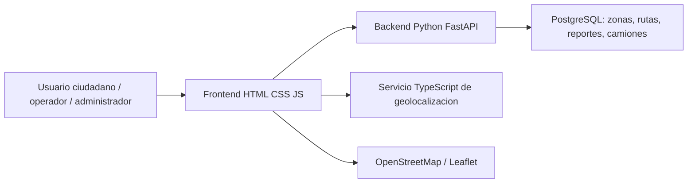

# Entrega 2 - Avance del proyecto

## I. Datos generales del proyecto

**Titulo:** Diseno e Implementacion de un Sistema Inteligente de Recoleccion de Residuos Solidos Segregados para la Gestion Ambiental Urbana en la ciudad del Cusco.

**Objetivo general:** Disenar e implementar un sistema que optimice la recoleccion de residuos, mejore la comunicacion con los ciudadanos y genere informacion para la toma de decisiones municipales.

**Objetivos especificos:**

- Permitir el registro e inicio de sesion de usuarios segun rol.
- Consultar horarios de recoleccion por zona.
- Reportar incidencias ciudadanas y hacer seguimiento.
- Visualizar rutas, camiones y alertas operativas.
- Mostrar indicadores basicos de cumplimiento del servicio.

**Alcance del sistema:** La version actual es un MVP funcional web con separacion entre frontend React/TypeScript, backend Python/FastAPI, servicio auxiliar TypeScript, base PostgreSQL y mapas OpenStreetMap. Cubre procesos de ciudadano, operador y administrador usando API REST.

**Tecnologias utilizadas:** React, TypeScript, Vite, Python, FastAPI, PostgreSQL, OpenStreetMap, Leaflet y API REST.

**Publico objetivo:** Ciudadanos del Cusco, operadores municipales, administradores y conductores de camiones recolectores.

## II. Arquitectura del sistema

El sistema usa una arquitectura cliente-servidor:

- **Frontend:** ubicado en `frontend/`, contiene una SPA React con TypeScript.
- **Backend principal:** ubicado en `backend-python/`, expone endpoints REST con FastAPI y centraliza datos de horarios, rutas, camiones, reportes e incidencias.
- **Backend auxiliar:** ubicado en `backend-typescript/`, simula geolocalizacion, ETA y alertas.
- **Base de datos:** scripts en `database/` para PostgreSQL.
- **Comunicacion:** el frontend consume la API mediante `fetch`.
- **Mapas:** el modulo de rutas usa OpenStreetMap mediante Leaflet.

## III. Metodo Scrum aplicado

### Product Backlog priorizado

| Prioridad | Historia | Impacto |
| --- | --- | --- |
| Alta | Registro e inicio de sesion | Control de acceso y personalizacion |
| Alta | Consulta de horarios | Reduce acumulacion de residuos |
| Alta | Reporte y seguimiento de incidencias | Mejora respuesta municipal |
| Alta | Visualizacion de rutas y alertas | Aumenta trazabilidad |
| Media | Clasificacion de residuos | Promueve cultura ambiental |
| Media | Gestion de camiones, zonas y rutas | Ordena la operacion |
| Media | Estadisticas del servicio | Apoya toma de decisiones |
| Baja | Respaldo, GPS real y notificaciones push | Incrementos futuros |

### Sprint 1

**Objetivo:** Construir la base de autenticacion simulada, navegacion y consulta ciudadana.

**Historias completadas:** HU1, HU2, HU4, HU10, HU11.

**Entregables:** Pantalla de ingreso, menu lateral, horarios por zona y guia de segregacion.

### Sprint 2

**Objetivo:** Implementar reportes ciudadanos, rutas, administracion e indicadores.

**Historias completadas:** HU5, HU6, HU7, HU8, HU9, HU12, HU13, HU15, HU16, HU18, HU19, HU20, HU21, HU22, HU24, HU25, HU29, HU30.

**Entregables:** Registro de incidencias, seguimiento, mapa operativo, camiones, historial, estadisticas y alertas.

## IV. Desarrollo por sprint

### Resultados funcionales

- El ciudadano puede registrarse, consultar horarios, ver alertas, revisar clasificacion de residuos y reportar incidencias.
- El operador/administrador puede revisar camiones, rutas, incidencias y estadisticas.
- El sistema consume datos desde FastAPI y puede persistirlos en PostgreSQL.
- La interfaz es responsive y puede usarse desde navegador movil.

### Definition of Done

- La historia tiene una pantalla o flujo visible.
- Los datos principales se muestran de forma clara.
- Las acciones del usuario actualizan el estado de la aplicacion.
- La funcionalidad aporta a un impacto social, ambiental u operativo.
- No se solicitan datos sensibles reales.

### Riesgos eticos, legales y sociales mitigados

- **Privacidad:** Se usa informacion simulada y persistencia local, sin envio a terceros.
- **Accesibilidad:** La interfaz usa contraste alto, botones claros y estructura responsive.
- **Impacto social:** Se priorizan reportes, horarios y alertas para reducir acumulacion de residuos.

## Evidencia de avance 50%

De 30 historias de usuario, el MVP cubre funcionalmente 25 en nivel prototipo o flujo demostrable. Las funcionalidades pendientes de mayor complejidad son GPS real, optimizacion automatica de rutas, backups y backend productivo.
